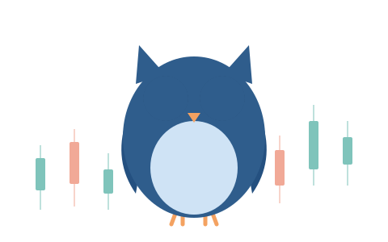

<h1 align="center">
   finlab
</h1>

<p align="center">
  
</p>

<p align="center">
  <a href="https://github.com/landtml/finlab-ml/actions/workflows/ci.yml"></a>
  <a href="https://github.com/landtml/finlab-ml/tags"></a>
  
  <a href="LICENSE"></a>
</p>

A toolkit for financial machine learning that implements the methods of
Marcos López de Prado's *Advances in Financial Machine Learning* (AFML),
organised by chapter. Hot loops are compiled to machine code with
[numba](https://numba.pydata.org/); there is no scikit-learn dependency.

Every method comes with tests that cross-check it against a naive reference, and
where the book states a result, a proof note under `docs/proofs/` that marks each
claim as proved here, checked by test, or claimed from the book only.

## Install

```bash
pip install -e .            # core library
pip install -e ".[dev]"     # + pytest, to run the test suite
pytest                      # run the suite
```

To install a tagged release instead:

```bash
pip install "git+https://github.com/landtml/finlab-ml@v0.1.0"
```

Requires Python 3.10 to 3.13.

## Quick start

These examples run as written (checked against the current code).

```python
import numpy as np
import pandas as pd
from finlab.cv import CombinatorialPurgedCV, make_t1
from finlab.stats import sharpe_ratio, deflated_sharpe_ratio
from finlab.bet_sizing import prob_bet_size, discretize_signal
from finlab.hrp import hrp_weights

rng = np.random.default_rng(0)
idx = pd.date_range("2020-01-01", periods=500, freq="B")

# 1. Leakage-free cross-validation for 10-bar forward labels (AFML ch. 7)
t1 = make_t1(idx, horizon=10)
cv = CombinatorialPurgedCV(n_groups=6, n_test_groups=2, embargo_pct=0.01, t1=t1)
X = pd.DataFrame(rng.normal(size=(500, 3)), index=idx)
print(sum(1 for _ in cv.split(X)), "purged splits")        # 15 purged splits

# 2. Backtest statistics: Sharpe and deflated Sharpe over 50 trials (AFML ch. 14)
r = pd.Series(rng.normal(0.0005, 0.01, 500), index=idx)
sr = sharpe_ratio(r, annualize=False)
print(round(deflated_sharpe_ratio(sr, n_trials=50, var_sr=0.01, n_obs=500,
                                  skew=0, kurt=3), 4))

# 3. Bet sizes from predicted probabilities, discretised (AFML ch. 10)
print(prob_bet_size([0.7, 0.2]).round(3), discretize_signal([0.33], 0.2))

# 4. Hierarchical risk parity weights (AFML ch. 16)
cov = pd.DataFrame(np.cov(rng.normal(size=(200, 5)).T),
                   columns=list("abcde"), index=list("abcde"))
print(hrp_weights(cov).round(3).to_dict())
```

## For AI agents

`finlab-mcp` is a local MCP server that exposes the main computations as typed
tools with compact JSON output. See [`docs/AGENTS.md`](docs/AGENTS.md).

## Modules

<details>
<summary><strong>Module map</strong>: chapters 2 to 20 (click to expand)</summary>

| Module | Chapter | What it provides |
|---|---|---|
| `finlab.cv` | 7 | `CombinatorialPurgedCV`, `PurgedKFold`, `make_t1` (purge and embargo) |
| `finlab.bars` | 2 | time, tick, volume, dollar, imbalance and run bars; CUSUM filter |
| `finlab.labeling` | 3 | daily volatility, triple-barrier events, bin labels, meta-labels, rare-label dropping, trend-scanning labels |
| `finlab.weights` | 4 | concurrency, average uniqueness, sequential bootstrap, return attribution, time decay |
| `finlab.monte_carlo` | 4 | seeded Monte Carlo trial runner (`run_trials`), random label sets, standard vs sequential bootstrap uniqueness experiment |
| `finlab.fracdiff` | 5 | fixed-width and expanding-window fractional differentiation, minimum-d search |
| `finlab.ensemble` | 6 | `SequentialBootstrapBagging` |
| `finlab.importance` | 8 | MDI, MDA, SFI, orthogonal features |
| `finlab.tuning` | 9 | grid and randomized search scored by purged CV |
| `finlab.bet_sizing` | 10 | probability and sigmoid bet sizing, target positions, limit prices, discretisation |
| `finlab.pbo` | 11-12 | probability of backtest overfitting by CSCV |
| `finlab.stats` | 14 | Sharpe, probabilistic and deflated Sharpe, minimum track record length |
| `finlab.hrp` | 16 | hierarchical risk parity |
| `finlab.structural_breaks` | 17 | CUSUM tests, Chu-Stinchcombe-White, SADF |
| `finlab.entropy` | 18 | plug-in, Lempel-Ziv and Kontoyiannis entropy; encoders |
| `finlab.microstructure` | 19 | tick rule, Roll, Corwin-Schultz, Becker-Parkinson, Kyle lambda, Amihud, VPIN |
| `finlab.parallel` | 20 | molecule partitioning and `mp_pandas_obj` on `concurrent.futures` |

Each module has its own page with a runnable example in
[`docs/modules/`](docs/modules/) (the examples are executed by
`tests/test_doc_examples.py`). The full signature list is in
[`docs/API.md`](docs/API.md), generated from the code by `tools/gen_api.py`.

</details>

## Validation status

<details>
<summary><strong>Validation status</strong>: what is proved, tested or only claimed (click to expand)</summary>

| Area | Status |
|---|---|
| CPCV purge and no-leakage property | Proved in [`docs/proofs/cpcv.md`](docs/proofs/cpcv.md); tests carried over from `purgedcv`. The live-data certificate in that file is the `purgedcv` run, not a `finlab` run. |
| Purged K-fold, tuning, bet sizing, parallel helpers | Tested. Book worked examples for bet sizing (sigmoid calibration, target 97, limit price 112.3657) are tests. |
| PBO via CSCV | Tested against a naive transcription. Under i.i.d. noise E[PBO] = 1/2 for even N (proved in `docs/proofs/pbo.md`), so a PBO near 1 is not a noise result. |
| Deflated Sharpe, PSR, minTRL | Tested on hand-checked values. minTRL is cited to Bailey and López de Prado (2012), not AFML. |
| VPIN and bulk-volume classification | Tested against a trade-level reference. The default scale is causal (expanding window), so no future prices enter the classification. The bulk-volume classifier is from Easley et al. (2012), not AFML. |
| Kyle lambda, Corwin-Schultz, Roll | Tested on synthetic data; the Corwin-Schultz and Kyle results are claimed from the book only. |
| SADF and CUSUM | Tested; the Chu-Stinchcombe-White critical value is read from an ambiguous radical in the book (see `docs/proofs/structural_breaks.md`). |
| Entropy | Tested on known cases. The Lempel-Ziv normalisation is the standard LZ78 one, not from AFML. |
| Trend-scanning labels | Implemented from the literal definition. Not in AFML ch. 3; the t-threshold of 1.96 is a design choice and the citation is not verified against a primary source. |
| Time decay | Proved and tested: the oldest observation's weight is `c + (1-c)·w1/T`, not exactly `c`. |
| Monte Carlo trials and bootstrap uniqueness (`finlab.monte_carlo`) | Tested against a dense reference (rtol 1e-12), with worker-count invariance and determinism checked by test; proofs and measurements in [`docs/proofs/monte_carlo.md`](docs/proofs/monte_carlo.md). The label design and defaults are choices of this repo, not from the book. The statistical gap is measured, not proved. |


</details>

## Benchmarks

<details>
<summary><strong>Benchmark table</strong> (click to expand)</summary>

Measured on the development machine with `benchmarks/bench_*.py`. Single
machine, numbers vary between runs.

| Hot path | Naive reference | Jitted | Speedup |
|---|---|---|---|
| `get_events` (triple barrier) | 2.66 s | 16.3 ms | ~163x |
| `trend_scanning_labels` | 7.75 s | 7.8 ms | ~991x |
| `sequential_bootstrap` | 1.50 s | 1.4 ms | ~1063x (the naive version is a dense loop, so this overstates the gain) |
| `num_co_events` | 74.6 ms | 8.4 ms | ~8.9x |
| SADF, n=300 | 8.31 s | 0.116 s | ~71x |
| Kontoyiannis entropy, n=300 | 0.080 s | 0.00013 s | ~605x |
| CUSUM test, n=2000 | 0.063 s | 0.00014 s | ~455x |
| VPIN, n=20k | (trade-expanded reference) | | ~202x |
| `tick_rule`, n=200k | | | ~59x |
| PBO, T=1200, N=40, S=12 | 2.09 s | 0.11 s | ~19x |
| HRP weights, n=200 | | | ~16x (SciPy linkage is not jitted and dominates at large N) |


</details>

## Scope and limitations

<details>
<summary><strong>Scope and limitations</strong> (click to expand)</summary>

- **Implementation.** Numba (LLVM machine code) is used for the hot loops. Rust and
  JAX are not used.
- **Not implemented:** a separate Mpool (AFML ch. 4 snippets 4.7-4.9); `mp_pandas_obj`
  in `finlab.parallel` is used for parallel work instead. Also the Chow DFC/SDFC and
  quantile ADF tests, the Bailey-Lopez de Prado distance-of-distances
  clustering variant, ONC clustering, and out-of-bag estimation for bagging.
- **No purging inside CSCV or importance.** Passing a purged splitter is the
  caller's responsibility for MDA and SFI; CSCV follows the book without purging.
- **Leakage beyond the splitter.** The CV guarantee covers the split boundary given
  the `t1` you supply. Leakage in your own feature construction is not detected.
- **Bar warm-up look-ahead.** Imbalance and runs bars estimate the expected
  imbalance from the first `init_T` ticks and then use it for the whole sample,
  which uses early data for later decisions. If the expected imbalance is 0 the
  threshold is 0 and every tick closes a bar, so zero-drift data gives very short
  bars. Runs bars use the book's `max{E[buy], E[sell]}` threshold, which is not
  `E[max]` (Jensen); the proof note shows this.
- **Python versions.** CI runs 3.10 to 3.13. Locally the suite was run on 3.13.
- **Sample size.** Average uniqueness and sequential-bootstrap gains are modest in
  practice (one measured setting gave 0.1963 vs 0.1913 over 200 seeds). The Monte
  Carlo experiment in `finlab.monte_carlo` gave a paired gap of about 0.084 at its
  default sizes (2000 trials, seed 0). That is a different label design and different
  settings, so the two numbers are not comparable. All of these are reported as
  measured, not as a book reproduction.

</details>

## Contributing

Each module has a test file in `tests/`, a benchmark in `benchmarks/`, and a proof
note in `docs/proofs/`. Keep claims in the proof notes to three kinds: proved here,
checked by test, or claimed from the book only.

## Credits

The methods implemented here come from Marcos López de Prado, *Advances in
Financial Machine Learning* (Wiley, 2018; ISBN 978-1-119-48208-6). The book's
text is not included in this repository; buy or borrow a copy to read the
derivations. The proof notes cite chapters and snippets by number.

Other sources named in the code and docs: López de Prado, Lewis and Boudt
(2019) for ONC clustering, and Bailey and López de Prado (2012) for the minimum
track record length. The purged cross-validation code and its proof come from
the [`purgedcv`](https://github.com/landtml/purgedcv) project.

## License

MIT; see [`LICENSE`](LICENSE). Parts of the CPCV implementation and its proof are ported from
[`purgedcv`](https://github.com/landtml/purgedcv), also MIT; see
`NOTICE_purgedcv_LICENSE.txt`.
